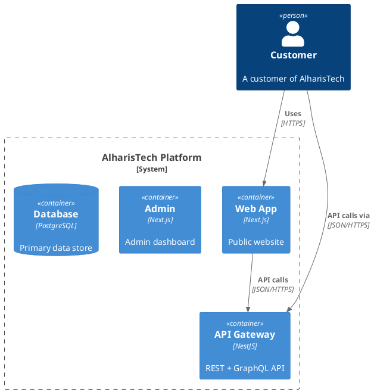

# Documentation Standards — AlharisTech Platform

## Overview

This document defines the complete documentation standards for the AlharisTech platform. Documentation is a first-class deliverable — no code merges without its corresponding documentation. The platform serves Arabic-speaking markets with international ambitions, requiring bilingual documentation for all user-facing content.

---

## Documentation-First Principle

```
CODE → DOCUMENTATION → MERGE

1. Write the specification/documentation FIRST
2. Implement the code SECOND
3. Review both together
4. Merge only when documentation is complete
```

---

## Documentation Types and Ownership

| Type | Location | Author | Reviewer | When |
|:---|:---|:---|:---|:---|
| Vision & Strategy | `docs/vision/` | Product Manager | Leadership | Sprint 0 |
| Business Model | `docs/business/` | Product Manager | Leadership | Sprint 0 |
| Product Requirements | `docs/requirements/` | Product Manager | Tech Lead | Sprint 0 + ongoing |
| Architecture Decisions | `docs/adr/` | Tech Lead / Developer | Team | At each decision |
| C4 Architecture Diagrams | `docs/c4/` | Tech Lead | Team | Sprint 0 + on change |
| API Documentation | OpenAPI (auto) | Developer | Reviewer | With each endpoint |
| README | Every module | Developer | Reviewer | With each module |
| Changelog | `CHANGELOG.md` | Tech Lead | Team | Per release |
| Code Comments | In source files | Developer | Reviewer | On write |
| Technical Diagrams | `docs/diagrams/` | Developer | Tech Lead | On need |
| Workflow Guides | `docs/workflows/` | Developer | Team | On need |
| Governance | `docs/governance/` | Tech Lead | Leadership | Sprint 0 |

---

## Module README Requirements

Every module, package, app, and domain MUST have a `README.md` containing:

```markdown
# Package/Module Name

## Purpose
[1-2 sentences explaining what this module does and why it exists]

## Installation
```bash
pnpm install  # Already part of monorepo
```

## Usage
```typescript
import { Something } from "@alharistech/package-name";

const result = Something.doSomething(params);
```

## API Reference
[Link to generated API docs or inline documentation]

## Dependencies
- `@alharistech/types` — Shared type definitions
- `@alharistech/utils` — Utility functions

## Configuration
| Variable | Type | Default | Description |
|:---|:---|:---|:---|
| `SOME_VAR` | string | — | Description |

## Testing
```bash
pnpm --filter=@alharistech/package-name test
```

## Architecture
[Brief description of internal structure and patterns used]

## Related ADRs
- [ADR-XXX: Title](./docs/adr/adr-XXX-title.md)
```

---

## API Documentation (OpenAPI)

### Auto-Generation from NestJS Decorators

Every controller MUST be decorated for OpenAPI generation:

```typescript
@ApiTags("Users")
@Controller({ path: "users", version: "1" })
export class UsersController {
  @Post()
  @ApiOperation({
    summary: "Create a new user",
    description: "Creates a new user account. An email verification link is sent to the provided email.",
  })
  @ApiBody({ type: CreateUserDto, description: "User creation payload" })
  @ApiResponse({
    status: 201,
    description: "User created successfully",
    type: UserResponseDto,
    headers: {
      Location: { description: "URL of the created user", schema: { type: "string" } },
    },
  })
  @ApiResponse({ status: 400, description: "Validation error", type: ApiErrorResponse })
  @ApiResponse({ status: 409, description: "Email already exists", type: ApiErrorResponse })
  async create(@Body() dto: CreateUserDto): Promise<ApiResponse<UserResponseDto>> { ... }
}
```

### DTO Documentation

```typescript
import { ApiProperty, ApiPropertyOptional } from "@nestjs/swagger";

export class CreateUserDto {
  @ApiProperty({
    description: "User email address",
    example: "user@example.com",
    maxLength: 255,
  })
  email: string;

  @ApiProperty({
    description: "Password (min 8 chars, must include upper, lower, digit, special)",
    example: "SecurePass123!",
    minLength: 8,
    maxLength: 128,
  })
  password: string;

  @ApiPropertyOptional({
    description: "User phone number in E.164 format",
    example: "+966501234567",
    pattern: "^\\+[1-9]\\d{6,14}$",
  })
  phone?: string;
}
```

### API Documentation Standards

1. `summary` — required, max 50 chars, English
2. `description` — required, include behavior notes, side effects, rate limits
3. All DTO properties MUST have `description` and `example`
4. All response types documented with exact schema
5. All error responses documented (400, 401, 403, 404, 409, 422, 429, 500 minimum)
6. Authentication requirements indicated via `@ApiBearerAuth()` or `@ApiSecurity()`
7. Deprecated endpoints marked with `@ApiDeprecated()` and `deprecated: true`

---

## Architecture Decision Records (ADRs)

### When to Write an ADR

Create an ADR when:
- Choosing between competing technologies or frameworks
- Making a significant architectural pattern decision
- Deprecating or replacing a major system component
- Changing a core architectural principle

### ADR Location

```
docs/adr/adr-NNN-slugified-title.md
```

### ADR Template

```markdown
# ADR-NNN: Title (50 chars max)

## Status (Status)
[Proposed | Accepted | Deprecated | Superseded]

## Context (Context)
[What is the problem? What forces are at play? Include enough context
for someone unfamiliar with the project to understand the decision.]

## Options Considered (Options)
1. Option A: [Description] — Pros: ... Cons: ...
2. Option B: [Description] — Pros: ... Cons: ...
3. Option C: [Description] — Pros: ... Cons: ...

## Decision (Decision)
[What did we choose and WHY? Include the rationale, not just the choice.]

## Consequences (Consequences)
- Positive: [What becomes easier/better]
- Negative: [What becomes harder/worse]
- Risks: [What could go wrong and mitigation]

## References (References)
- [Link to related docs, RFCs, external articles]
```

### ADR Lifecycle

```
Proposed → Accepted → (Deprecated → Superseded)
```

When an ADR is superseded, the new ADR must reference the old one and explain why.

---

## Changelog

### Format (Keep a Changelog)

```markdown
# Changelog

## [1.0.0] — 2026-12-01

### Added
- User authentication with JWT
- Customer management CRUD
- Order creation and tracking

### Changed
- Upgraded Next.js to v15
- Migrated API responses to standard envelope

### Deprecated
- `/api/v1/legacy/users` — use `/api/v1/users` instead

### Removed
- Old admin dashboard (replaced by new Next.js admin)

### Fixed
- Duplicate order submission on double click
- Token refresh race condition

### Security
- Patched CVE-2024-xxxx in express dependency
```

### Rules

1. One `CHANGELOG.md` at the repository root
2. Ordered by version, newest first
3. Semantic Versioning (MAJOR.MINOR.PATCH)
4. Sections: Added, Changed, Deprecated, Removed, Fixed, Security
5. Each entry links to relevant issue/PR
6. Updated on every release (not every merge)

---

## Code Comments

### JSDoc for Public APIs (REQUIRED)

```typescript
/**
 * Creates a new customer in the system.
 *
 * @param input - Customer creation data
 * @returns The created customer entity
 * @throws {CustomerAlreadyExistsError} If a customer with the same tax number exists
 * @throws {ValidationError} If input validation fails
 *
 * @example
 * ```ts
 * const customer = await customerService.create({
 *   userId: "uuid",
 *   type: "company",
 *   companyName: "شركة التقنية",
 *   taxNumber: "300000000000003",
 * });
 * ```
 */
async createCustomer(input: CreateCustomerInput): Promise<Customer> { ... }
```

### Inline Comments (ONLY for Complex Logic)

```typescript
// ✅ Explain WHY, not WHAT
// The order of these operations matters: we must invalidate
// the cache BEFORE committing the transaction to prevent
// stale reads during the commit window.
await cache.invalidate(key);
await transaction.commit();

// ❌ Don't state the obvious
// Create a new order
const order = await createOrder(data);
```

### TODO and FIXME

```typescript
// TODO(@username): Implement email notification — https://github.com/alharistech/platform/issues/42
// FIXME: This query becomes O(n^2) with large datasets — see issue #128
// HACK: Workaround for Prisma issue #12345, remove when fixed upstream
```

### Forbidden Comment Patterns

```typescript
// ❌ Commented-out code (use git history)
// const oldVersion = await someOldFunction();

// ❌ Diary comments
// 2026-06-20: Ahmed changed this to fix bug #123

// ❌ Redundant JSDoc on internal functions
/**
 * @param x - The x parameter
 * @returns The result
 */
function internalHelper(x: number): number { return x * 2; }  // No public API, no JSDoc needed
```

---

## Diagrams

### PlantUML Source in `docs/diagrams/`

All architectural diagrams must have PlantUML source files committed. Generated images are secondary artifacts.

```
docs/diagrams/
├── c4/
│   ├── system-context.puml
│   ├── container.puml
│   └── component-identity.puml
├── sequence/
│   ├── user-login.puml
│   └── order-lifecycle.puml
├── erd/
│   └── core-schema.puml
└── deployment/
    └── production.puml
```

### PlantUML Example



### Diagram Rules

1. PlantUML source is the source of truth — commit `.puml` files
2. Generated PNG/SVG in same directory for quick preview
3. C4 model for architecture diagrams (Context, Container, Component, Code)
4. Update diagrams when architecture changes (diagram drift is technical debt)
5. Use the C4-PlantUML standard library for consistency

---

## Bilingual Requirement (Arabic + English)

### User-Facing Documentation

All user-facing documentation (product docs, help articles, UI text) MUST be available in Arabic and English.

| Component | Arabic | English |
|:---|:---|:---|
| Product documentation | Primary | Secondary |
| API error messages | `messageAr` field | `message` field |
| UI text | Default locale (ar) | Translation files |
| Help articles | Original (ar) | Translation |
| Marketing website | Arabic | English |

### Translation Files

```json
// apps/web/messages/ar.json
{
  "auth": {
    "login": "تسجيل الدخول",
    "register": "إنشاء حساب",
    "forgotPassword": "نسيت كلمة المرور",
    "emailLabel": "البريد الإلكتروني",
    "passwordLabel": "كلمة المرور"
  }
}

// apps/web/messages/en.json
{
  "auth": {
    "login": "Login",
    "register": "Register",
    "forgotPassword": "Forgot Password",
    "emailLabel": "Email",
    "passwordLabel": "Password"
  }
}
```

### Translation Standards

1. Use `next-intl` for Next.js apps
2. Translation keys in camelCase, organized by feature
3. Arabic is the PRIMARY locale (default)
4. English translations are mandatory for all user-facing strings
5. RTL layout for Arabic, LTR for English
6. Date formats: Hijri + Gregorian for Arabic, Gregorian for English
7. Currency: SAR default, format with locale-aware `Intl.NumberFormat`

### Code & Technical Documentation

Technical documentation (READMEs, ADRs, code comments, architecture docs) is written in **English** ONLY. User-facing documentation is bilingual.

---

## Documentation Review Checklist

### For Every PR

- [ ] API endpoints have OpenAPI decorators with description and examples
- [ ] New DTOs have `@ApiProperty` decorators with description and example
- [ ] Error responses documented (all relevant status codes)
- [ ] Breaking changes documented in PR description
- [ ] Related ADR updated or new ADR created if needed
- [ ] Module README updated if new features added
- [ ] Changelog entry added (if applicable, in release PR)

### For Every Release

- [ ] CHANGELOG.md updated with all changes since last release
- [ ] Version bumped according to SemVer
- [ ] Release notes written (for GitHub Releases)
- [ ] API docs regenerated and verified
- [ ] Architecture diagrams reviewed for drift
- [ ] Translation files updated for new UI strings

---

## Documentation Tooling

| Purpose | Tool |
|:---|:---|
| API Documentation | OpenAPI/Swagger (auto-generated from NestJS) |
| Code API docs | TypeDoc (generated from JSDoc) |
| Architecture diagrams | PlantUML + C4-PlantUML |
| Sequence diagrams | PlantUML |
| ERD diagrams | PlantUML or Prisma Studio export |
| README formatting | Markdown (GitHub Flavored) |
| Changelog | Markdown (Keep a Changelog format) |
| Translation management | next-intl JSON files |
| Diagram rendering | PlantUML CLI or VS Code extension |

### Generating Documentation

```bash
# Generate API docs (happens automatically on api start)
curl http://localhost:4000/api/docs-json > docs/api/openapi.json

# Generate TypeDoc (code API reference)
pnpm run docs:generate

# Render PlantUML diagrams to PNG
for f in docs/diagrams/**/*.puml; do
  plantuml "$f"
done
```

---

## Documentation Directory Structure

```
docs/
├── vision/                     # Product vision and strategy
│   ├── product-vision.md
│   └── market-analysis.md
├── business/                   # Business model and plans
│   ├── business-model.md
│   └── revenue-model.md
├── requirements/               # Product requirements
│   ├── functional-requirements.md
│   └── non-functional-requirements.md
├── architecture/               # Architecture documentation
│   ├── README.md               # Architecture overview
│   └── ... (in architecture/ dir)
├── adr/                        # Architecture Decision Records
│   ├── README.md
│   ├── adr-001-nextjs-frontend.md
│   └── ...
├── c4/                         # C4 Architecture diagrams
│   ├── system-context.puml
│   ├── container.puml
│   └── component-identity.puml
├── diagrams/                   # Other technical diagrams
│   ├── sequence/
│   ├── erd/
│   └── deployment/
├── roadmap/                    # Product and technical roadmap
│   ├── product-roadmap.md
│   └── technical-roadmap.md
├── workflows/                  # Development workflows
│   ├── development-workflow.md
│   ├── release-workflow.md
│   └── incident-response.md
└── governance/                 # Governance documents
    ├── README.md
    ├── code-review.md
    └── quality-gates.md
```
