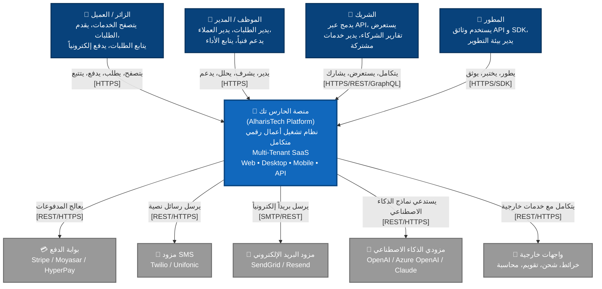
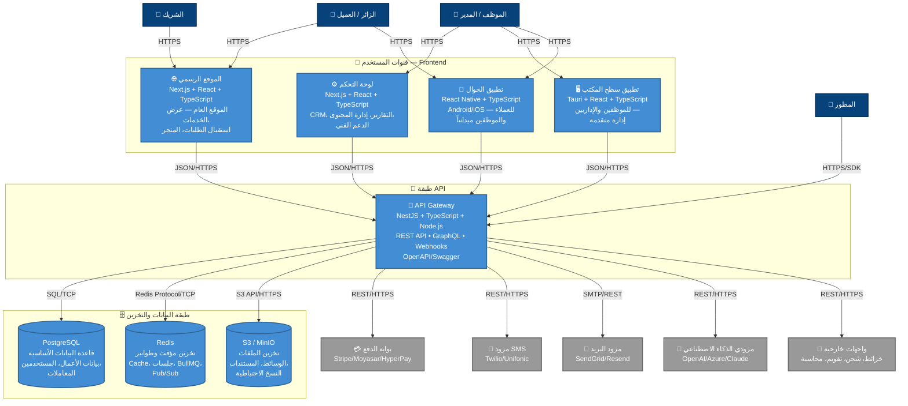
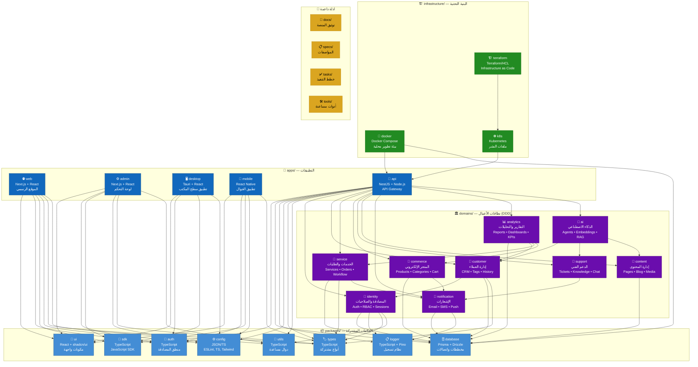

```mermaid
graph TB
    %% Styles
    classDef frontend fill:#438DD5,color:#fff,stroke:#2E6290
    classDef module fill:#1168BD,color:#fff,stroke:#0B4884
    classDef db fill:#438DD5,color:#fff,stroke:#2E6290,shape:cylinder
    classDef external fill:#999,color:#fff,stroke:#6B6B6B
    classDef boundary fill:none,stroke:#1168BD,stroke-dasharray:5 5

    subgraph Frontends["📱 قنوات المستخدم"]
        Web["الموقع الرسمي<br/>Next.js"]:::frontend
        Admin["لوحة التحكم<br/>Next.js"]:::frontend
        Desktop["سطح المكتب<br/>Tauri"]:::frontend
        Mobile["الجوال<br/>React Native"]:::frontend
    end

    subgraph APIGateway["🔌 NestJS API Gateway"]
        subgraph Core["الوحدات الأساسية"]
            Auth["🔐 مصادقة Auth Module<br/>Login • Register • JWT<br/>RBAC • Refresh Tokens"]:::module
            User["👤 مستخدم User Module<br/>Profile • Settings<br/>Sessions • Preferences"]:::module
            Customer["👥 عميل Customer Module<br/>CRUD • Tags<br/>History • Classification"]:::module
        end

        subgraph Business["وحدات الأعمال"]
            Service["🔧 خدمات Service Module<br/>Services • Orders<br/>Workflow • Documents"]:::module
            Commerce["🛒 متجر Commerce Module<br/>Products • Categories<br/>Cart • Inventory"]:::module
            Payment["💳 مدفوعات Payment Module<br/>Invoices • Gateways<br/>Receipts"]:::module
        end

        subgraph Support["وحدات الدعم"]
            SupportMod["🎫 دعم Support Module<br/>Tickets • Knowledge<br/>Chat"]:::module
            CMS["📝 محتوى CMS Module<br/>Pages • Blog<br/>Media"]:::module
        end

        subgraph Infra["البنية التحتية والتحليلات"]
            Notification["🔔 إشعارات Notification Module<br/>Email • SMS<br/>Push"]:::module
            Analytics["📊 تحليلات Analytics Module<br/>Reports • Dashboards<br/>KPIs"]:::module
            AIMod["🤖 ذكاء AI Module<br/>Agents • Embeddings<br/>RAG"]:::module
        end
    end

    subgraph Data["🗄️ طبقة البيانات"]
        PostgreSQL[("PostgreSQL<br/>Primary Database")]:::db
        Redis[("Redis<br/>Cache • Queue")]:::db
        S3[("S3 / MinIO<br/>File Storage")]:::db
    end

    subgraph External["🌐 الخدمات الخارجية"]
        PayGate["💳 بوابة الدفع<br/>Stripe/Moyasar"]:::external
        SMSProv["📱 مزود SMS<br/>Twilio/Unifonic"]:::external
        EmailProv["📧 مزود البريد<br/>SendGrid/Resend"]:::external
        AIProv["🤖 مزودي AI<br/>OpenAI/Azure/Claude"]:::external
    end

    %% Frontends → Modules
    Web --> Auth
    Web --> Customer
    Web --> Service
    Web --> Commerce
    Admin --> Auth
    Admin --> User
    Admin --> Customer
    Admin --> Service
    Admin --> Commerce
    Admin --> Payment
    Admin --> SupportMod
    Admin --> CMS
    Admin --> Analytics
    Desktop --> Auth
    Desktop --> Service
    Desktop --> Analytics
    Mobile --> Auth
    Mobile --> Service
    Mobile --> Notification

    %% Internal Module Relations
    Auth --> User
    Auth --> Notification
    Customer --> Service
    Customer --> Payment
    Service --> Payment
    Service --> Notification
    Commerce --> Payment
    Commerce --> Notification
    SupportMod --> Notification
    CMS --> Notification
    Analytics --> Customer
    Analytics --> Service
    Analytics --> Commerce
    AIMod --> Customer
    AIMod --> SupportMod
    AIMod --> CMS

    %% Modules → PostgreSQL
    Auth --> PostgreSQL
    User --> PostgreSQL
    Customer --> PostgreSQL
    Service --> PostgreSQL
    Commerce --> PostgreSQL
    Payment --> PostgreSQL
    SupportMod --> PostgreSQL
    CMS --> PostgreSQL
    Notification --> PostgreSQL
    Analytics --> PostgreSQL
    AIMod --> PostgreSQL

    %% Modules → Redis
    Auth --> Redis
    Service --> Redis
    Commerce --> Redis
    Notification --> Redis
    Analytics --> Redis

    %% Modules → S3
    CMS --> S3
    Service --> S3
    Commerce --> S3

    %% Modules → External
    Payment --> PayGate
    Notification --> SMSProv
    Notification --> EmailProv
    AIMod --> AIProv
```

# C4 Architecture Model — منصة الحارس تك (AlharisTech Platform)

> توثيق معتمد على نموذج C4 للمعمارية البرمجية، يغطي المستويات الأربعة الكاملة مع مخططات PlantUML و Mermaid لكل مستوى.

---

## جدول المحتويات

1. [المستوى 1: مخطط السياق (System Context Diagram)](#المستوى-1-مخطط-السياق-system-context-diagram)
2. [المستوى 2: مخطط الحاويات (Container Diagram)](#المستوى-2-مخطط-الحاويات-container-diagram)
3. [المستوى 3: مخطط المكونات (Component Diagram)](#المستوى-3-مخطط-المكونات-component-diagram)
4. [المستوى 4: مخطط الكود (Code Diagram)](#المستوى-4-مخطط-الكود-code-diagram)

---

## المستوى 1: مخطط السياق (System Context Diagram)

### الوصف

يعرض **مخطط السياق** المنصة كصندوق أسود واحد في مركز الصورة، محاطاً بالمستخدمين الأساسيين (Actors) والأنظمة الخارجية المتكاملة. هذا المستوى مخصص للإدارة العليا وأصحاب المصلحة غير التقنيين لفهم حدود النظام والتفاعلات الرئيسية.

- **المستخدمون**: الزائر/العميل، الموظف/المدير، الشريك، المطور
- **النظام المركزي**: منصة الحارس تك (AlharisTech Platform)
- **الأنظمة الخارجية**: بوابة الدفع، مزود SMS، مزود البريد الإلكتروني، مزودي الذكاء الاصطناعي، واجهات خارجية

### PlantUML

```plantuml
@startuml C4_Context_AlharisTech
!include https://raw.githubusercontent.com/plantuml-stdlib/C4-PlantUML/master/C4_Context.puml

LAYOUT_WITH_LEGEND()

title المستوى 1 — مخطط السياق (System Context Diagram) — منصة الحارس تك

' === Actors ===
Person(visitor_customer, "الزائر / العميل", "يتصفح الخدمات، يقدم الطلبات، يتابع الطلبات، يدفع إلكترونياً")
Person(employee_manager, "الموظف / المدير", "يدير الطلبات، يدير العملاء، يدعم فنياً، يتابع الأداء")
Person(partner, "الشريك", "يدمج عبر API، يستعرض تقارير الشركاء، يدير خدمات مشتركة")
Person(developer, "المطور", "يستخدم وثائق API و SDK، يدير بيئة التطوير")

' === Core System ===
System(alharistech, "منصة الحارس تك", "نظام تشغيل أعمال رقمي متكامل — Multi-Tenant SaaS\nيدير كافة أعمال المؤسسة عبر Web, Desktop, Mobile, API")

' === External Systems ===
System_Ext(payment_gateway, "بوابة الدفع", "معالجة المدفوعات الإلكترونية\n(Stripe / Moyasar / HyperPay)")
System_Ext(sms_provider, "مزود SMS", "إرسال الرسائل النصية\n(Twilio / Unifonic)")
System_Ext(email_provider, "مزود البريد الإلكتروني", "إرسال البريد الإلكتروني\n(SendGrid / Resend)")
System_Ext(ai_providers, "مزودي الذكاء الاصطناعي", "نماذج اللغة والمعالجة\n(OpenAI / Azure OpenAI / Claude)")
System_Ext(external_apis, "واجهات خارجية", "خدمات الطرف الثالث\n(خرائط، شحن، تقويم، محاسبة)")

' === Relationships: Actors -> System ===
Rel(visitor_customer, alharistech, "يتصفح، يطلب، يدفع، يتتبع", "HTTPS")
Rel(employee_manager, alharistech, "يدير، يشرف، يحلل، يدعم", "HTTPS")
Rel(partner, alharistech, "يتكامل، يستعرض، يشارك", "HTTPS/REST/GraphQL")
Rel(developer, alharistech, "يطور، يختبر، يوثق", "HTTPS/SDK")

' === Relationships: System -> External Systems ===
Rel(alharistech, payment_gateway, "يعالج المدفوعات", "REST/HTTPS")
Rel(alharistech, sms_provider, "يرسل رسائل نصية", "REST/HTTPS")
Rel(alharistech, email_provider, "يرسل بريداً إلكترونياً", "SMTP/REST")
Rel(alharistech, ai_providers, "يستدعي نماذج الذكاء الاصطناعي", "REST/HTTPS")
Rel(alharistech, external_apis, "يتكامل مع خدمات خارجية", "REST/HTTPS")

@enduml
```

### Mermaid



---

## المستوى 2: مخطط الحاويات (Container Diagram)

### الوصف

يعرض **مخطط الحاويات** التطبيقات الرئيسية ومخازن البيانات التي تشكل المنصة. يظهر كيفية توزيع النظام عبر قنوات مختلفة (Web، Desktop، Mobile) واتصالها جميعاً عبر API Gateway موحد، مع قواعد البيانات والتخزين في طبقة البنية التحتية.

- **قنوات المستخدم**: Web Browser، Desktop (Tauri)، Mobile (React Native)
- **الواجهات الأمامية**: Next.js Frontend، Next.js Admin Dashboard
- **طبقة API**: NestJS API Gateway (REST + GraphQL)
- **قواعد البيانات**: PostgreSQL (Primary)، Redis (Cache/Queue)
- **التخزين**: S3/MinIO (File Storage)

### PlantUML

```plantuml
@startuml C4_Container_AlharisTech
!include https://raw.githubusercontent.com/plantuml-stdlib/C4-PlantUML/master/C4_Container.puml

LAYOUT_WITH_LEGEND()

title المستوى 2 — مخطط الحاويات (Container Diagram) — منصة الحارس تك

' === Users ===
Person(visitor_customer, "الزائر / العميل")
Person(employee_manager, "الموظف / المدير")
Person(partner, "الشريك")
Person(developer, "المطور")

' === Frontend Containers ===
System_Boundary(frontend_boundary, "قنوات المستخدم — Frontend") {
    Container(web_frontend, "الموقع الرسمي", "Next.js + React + TypeScript", "الموقع العام — عرض الخدمات، استقبال الطلبات، المتجر الإلكتروني")
    Container(admin_dashboard, "لوحة التحكم", "Next.js + React + TypeScript", "لوحة الإدارة — CRM، التقارير، إدارة المحتوى، الدعم الفني")
    Container(desktop_app, "تطبيق سطح المكتب", "Tauri + React + TypeScript", "تطبيق مكتبي للموظفين والإداريين — إدارة متقدمة")
    Container(mobile_app, "تطبيق الجوال", "React Native + TypeScript", "تطبيق Android/iOS — للعملاء والموظفين ميدانياً")
}

' === API Layer ===
System_Boundary(api_boundary, "طبقة API") {
    Container(api_gateway, "API Gateway", "NestJS + TypeScript + Node.js", "نقطة الدخول الموحدة — REST API، GraphQL، Webhooks، OpenAPI/Swagger")
}

' === Data Layer ===
System_Boundary(data_boundary, "طبقة البيانات والتخزين") {
    ContainerDb(postgresql, "PostgreSQL", "قاعدة بيانات علائقية", "قاعدة البيانات الأساسية — جميع بيانات الأعمال، المستخدمين، المعاملات")
    ContainerDb(redis, "Redis", "تخزين مؤقت وطوابير", "التخزين المؤقت، الجلسات، طوابير المهام (BullMQ)، Pub/Sub")
    ContainerDb(s3_storage, "S3 / MinIO", "تخزين الملفات", "تخزين الملفات، الوسائط، المستندات، النسخ الاحتياطية")
}

' === External Systems ===
System_Ext(payment_gateway, "بوابة الدفع", "Stripe / Moyasar / HyperPay")
System_Ext(sms_provider, "مزود SMS", "Twilio / Unifonic")
System_Ext(email_provider, "مزود البريد الإلكتروني", "SendGrid / Resend")
System_Ext(ai_providers, "مزودي الذكاء الاصطناعي", "OpenAI / Azure OpenAI / Claude")
System_Ext(external_apis, "واجهات خارجية", "خرائط، شحن، تقويم، محاسبة")

' === Relationships: Users -> Frontends ===
Rel(visitor_customer, web_frontend, "يتصفح، يطلب، يدفع", "HTTPS")
Rel(visitor_customer, mobile_app, "يتصفح، يطلب، يدفع", "HTTPS")
Rel(employee_manager, admin_dashboard, "يدير، يشرف، يحلل", "HTTPS")
Rel(employee_manager, desktop_app, "يدير، يشرف، يحلل", "HTTPS")
Rel(employee_manager, mobile_app, "يدير ميدانياً", "HTTPS")
Rel(partner, web_frontend, "يستعرض الخدمات", "HTTPS")
Rel(developer, api_gateway, "يختبر، يدمج", "HTTPS/SDK")

' === Relationships: Frontends -> API ===
Rel(web_frontend, api_gateway, "يستدعي API", "JSON/HTTPS")
Rel(admin_dashboard, api_gateway, "يستدعي API", "JSON/HTTPS")
Rel(desktop_app, api_gateway, "يستدعي API", "JSON/HTTPS")
Rel(mobile_app, api_gateway, "يستدعي API", "JSON/HTTPS")

' === Relationships: API -> Data Stores ===
Rel(api_gateway, postgresql, "يقرأ ويكتب البيانات", "SQL/TCP")
Rel(api_gateway, redis, "يقرأ ويكتب التخزين المؤقت والطوابير", "Redis Protocol/TCP")
Rel(api_gateway, s3_storage, "يقرأ ويكتب الملفات والوسائط", "S3 API/HTTPS")

' === Relationships: API -> External Systems ===
Rel(api_gateway, payment_gateway, "يعالج المدفوعات", "REST/HTTPS")
Rel(api_gateway, sms_provider, "يرسل رسائل نصية", "REST/HTTPS")
Rel(api_gateway, email_provider, "يرسل بريداً إلكترونياً", "SMTP/REST")
Rel(api_gateway, ai_providers, "يستدعي نماذج الذكاء الاصطناعي", "REST/HTTPS")
Rel(api_gateway, external_apis, "يتكامل مع خدمات خارجية", "REST/HTTPS")

@enduml
```

### Mermaid



---

## المستوى 3: مخطط المكونات (Component Diagram)

### الوصف

يعرض **مخطط المكونات** الهيكل الداخلي لـ API Gateway (NestJS)، مفككاً إلى 11 وحدة نمطية (Modules) تمثل نطاقات الأعمال المختلفة. كل وحدة مسؤولة عن مجموعة محددة من الوظائف، وتتواصل مع بعضها البعض عبر واجهات برمجية داخلية ومع قواعد البيانات والخدمات الخارجية.

- **الوحدات الأساسية**: Auth، User، Customer
- **وحدات الأعمال**: Service، Commerce، Payment
- **وحدات الدعم**: Support، CMS، Notification
- **وحدات التحليل والذكاء**: Analytics، AI

### PlantUML

```plantuml
@startuml C4_Component_AlharisTech
!include https://raw.githubusercontent.com/plantuml-stdlib/C4-PlantUML/master/C4_Component.puml

LAYOUT_WITH_LEGEND()

title المستوى 3 — مخطط المكونات (Component Diagram) — NestJS API Gateway

' === Frontend Containers ===
Container(web_frontend, "الموقع الرسمي", "Next.js")
Container(admin_dashboard, "لوحة التحكم", "Next.js")
Container(desktop_app, "تطبيق سطح المكتب", "Tauri")
Container(mobile_app, "تطبيق الجوال", "React Native")

' === API Gateway Boundary ===
System_Boundary(api_gateway_boundary, "API Gateway — NestJS") {

    ' === Core Modules ===
    Container(auth_module, "مصادقة Auth Module", "NestJS Module", "تسجيل الدخول، التسجيل، JWT، RBAC، الصلاحيات، Refresh Tokens")
    Container(user_module, "مستخدم User Module", "NestJS Module", "الملف الشخصي، الإعدادات، الجلسات، تفضيلات المستخدم")
    Container(customer_module, "عميل Customer Module", "NestJS Module", "CRUD العملاء، الوسوم Tags، السجل History، التصنيف")

    ' === Business Modules ===
    Container(service_module, "خدمات Service Module", "NestJS Module", "الخدمات Services، الطلبات Orders، سير العمل Workflow، المستندات Documents")
    Container(commerce_module, "متجر Commerce Module", "NestJS Module", "المنتجات Products، التصنيفات Categories، السلة Cart، المخزون Inventory")
    Container(payment_module, "مدفوعات Payment Module", "NestJS Module", "الفواتير Invoices، بوابات الدفع Gateways، الإيصالات Receipts")

    ' === Support Modules ===
    Container(support_module, "دعم Support Module", "NestJS Module", "التذاكر Tickets، قاعدة المعرفة Knowledge، المحادثة Chat")
    Container(cms_module, "محتوى CMS Module", "NestJS Module", "الصفحات Pages، المدونة Blog، الوسائط Media")

    ' === Infrastructure Modules ===
    Container(notification_module, "إشعارات Notification Module", "NestJS Module", "البريد الإلكتروني Email، الرسائل SMS، الإشعارات Push")
    Container(analytics_module, "تحليلات Analytics Module", "NestJS Module", "التقارير Reports، لوحاتDashboard، المؤشرات KPIs")
    Container(ai_module, "ذكاء AI Module", "NestJS Module", "الوكلاء Agents، التضمينات Embeddings، التوليد المعزز RAG")
}

' === Data Stores ===
ContainerDb(postgresql, "PostgreSQL", "قاعدة بيانات")
ContainerDb(redis, "Redis", "تخزين مؤقت وطوابير")
ContainerDb(s3_storage, "S3 / MinIO", "تخزين الملفات")

' === External Systems ===
System_Ext(payment_gateway, "بوابة الدفع", "Stripe/Moyasar")
System_Ext(sms_provider, "مزود SMS", "Twilio/Unifonic")
System_Ext(email_provider, "مزود البريد", "SendGrid/Resend")
System_Ext(ai_providers, "مزودي AI", "OpenAI/Azure/Claude")

' === Relationships: Frontends -> API Gateway ===
Rel(web_frontend, auth_module, "مصادقة وتصفح", "JSON/HTTPS")
Rel(web_frontend, customer_module, "تقديم الطلبات", "JSON/HTTPS")
Rel(web_frontend, service_module, "تصفح الخدمات", "JSON/HTTPS")
Rel(web_frontend, commerce_module, "تصفح المتجر", "JSON/HTTPS")
Rel(admin_dashboard, auth_module, "تسجيل الدخول", "JSON/HTTPS")
Rel(admin_dashboard, user_module, "إدارة المستخدمين", "JSON/HTTPS")
Rel(admin_dashboard, customer_module, "إدارة العملاء", "JSON/HTTPS")
Rel(admin_dashboard, service_module, "إدارة الخدمات", "JSON/HTTPS")
Rel(admin_dashboard, commerce_module, "إدارة المتجر", "JSON/HTTPS")
Rel(admin_dashboard, payment_module, "إدارة المدفوعات", "JSON/HTTPS")
Rel(admin_dashboard, support_module, "الدعم الفني", "JSON/HTTPS")
Rel(admin_dashboard, cms_module, "إدارة المحتوى", "JSON/HTTPS")
Rel(admin_dashboard, analytics_module, "التقارير", "JSON/HTTPS")
Rel(desktop_app, auth_module, "مصادقة", "JSON/HTTPS")
Rel(desktop_app, service_module, "إدارة متقدمة", "JSON/HTTPS")
Rel(desktop_app, analytics_module, "لوحات القيادة", "JSON/HTTPS")
Rel(mobile_app, auth_module, "مصادقة", "JSON/HTTPS")
Rel(mobile_app, service_module, "طلبات ميدانية", "JSON/HTTPS")
Rel(mobile_app, notification_module, "إشعارات", "JSON/HTTPS")

' === Internal Module Relationships ===
Rel(auth_module, user_module, "إنشاء/استعلام مستخدم", "NestJS DI")
Rel(auth_module, notification_module, "إشعارات المصادقة", "NestJS DI")
Rel(customer_module, service_module, "ربط العميل بالخدمات", "NestJS DI")
Rel(customer_module, payment_module, "سجل المدفوعات", "NestJS DI")
Rel(service_module, payment_module, "فواتير الخدمات", "NestJS DI")
Rel(service_module, notification_module, "إشعارات الطلبات", "NestJS DI")
Rel(commerce_module, payment_module, "دفع المشتريات", "NestJS DI")
Rel(commerce_module, notification_module, "إشعارات المتجر", "NestJS DI")
Rel(support_module, notification_module, "إشعارات التذاكر", "NestJS DI")
Rel(cms_module, notification_module, "إشعارات المحتوى", "NestJS DI")
Rel(analytics_module, customer_module, "تحليل بيانات العملاء", "NestJS DI")
Rel(analytics_module, service_module, "تحليل الخدمات", "NestJS DI")
Rel(analytics_module, commerce_module, "تحليل المبيعات", "NestJS DI")
Rel(ai_module, customer_module, "ذكاء العملاء", "NestJS DI")
Rel(ai_module, support_module, "دعم ذكي", "NestJS DI")
Rel(ai_module, cms_module, "توليد محتوى", "NestJS DI")

' === Module -> Data Store Relationships ===
Rel(auth_module, postgresql, "مستخدمين وجلسات", "SQL")
Rel(user_module, postgresql, "ملفات وإعدادات", "SQL")
Rel(customer_module, postgresql, "بيانات العملاء", "SQL")
Rel(service_module, postgresql, "خدمات وطلبات", "SQL")
Rel(commerce_module, postgresql, "منتجات ومخزون", "SQL")
Rel(payment_module, postgresql, "فواتير ومعاملات", "SQL")
Rel(support_module, postgresql, "تذاكر ومعرفة", "SQL")
Rel(cms_module, postgresql, "صفحات ومقالات", "SQL")
Rel(notification_module, postgresql, "سجل الإشعارات", "SQL")
Rel(analytics_module, postgresql, "بيانات تحليلية", "SQL")
Rel(ai_module, postgresql, "تضمينات وسياقات", "SQL")

Rel(auth_module, redis, "جلسات وقوائم سوداء", "Redis")
Rel(service_module, redis, "طوابير المهام", "Redis/BullMQ")
Rel(commerce_module, redis, "ذاكرة السلة", "Redis")
Rel(notification_module, redis, "طوابير الإشعارات", "Redis/BullMQ")
Rel(analytics_module, redis, "ذاكرة مؤقتة للتقارير", "Redis")

Rel(cms_module, s3_storage, "وسائط وملفات", "S3 API")
Rel(service_module, s3_storage, "مستندات", "S3 API")
Rel(commerce_module, s3_storage, "صور المنتجات", "S3 API")

' === Module -> External System Relationships ===
Rel(payment_module, payment_gateway, "معالجة الدفع", "REST/HTTPS")
Rel(notification_module, sms_provider, "إرسال SMS", "REST/HTTPS")
Rel(notification_module, email_provider, "إرسال بريد", "SMTP/REST")
Rel(ai_module, ai_providers, "استدعاء نماذج AI", "REST/HTTPS")

@enduml
```

### Mermaid



---

## المستوى 4: مخطط الكود (Code Diagram)

### الوصف

يعرض **مخطط الكود** هيكل المشروع الكامل (Monorepo) على مستوى المجلدات والمكتبات. يوضح كيفية تنظيم الكود المصدري عبر التطبيقات (apps/) والمكتبات المشتركة (packages/) ونطاقات الأعمال (domains/) والبنية التحتية (infrastructure/)، مع العلاقات والاعتماديات بينها.

- **apps/**: التطبيقات الخمسة (web، admin، desktop، mobile، api)
- **packages/**: 8 مكتبات مشتركة (ui، auth، database، sdk، config، logger، types، utils)
- **domains/**: 9 نطاقات أعمال (identity، customer، service، commerce، support، content، notification، analytics، ai)
- **infrastructure/**: docker، k8s، terraform
- **أدلة داعمة**: docs/، specs/، tasks/، tools/

### PlantUML

```plantuml
@startuml C4_Code_AlharisTech
!include https://raw.githubusercontent.com/plantuml-stdlib/C4-PlantUML/master/C4_Component.puml

LAYOUT_WITH_LEGEND()

title المستوى 4 — مخطط الكود (Code Diagram) — Monorepo Structure

' === Apps ===
System_Boundary(apps_boundary, "apps/ — التطبيقات") {
    Container(app_web, "web", "Next.js + React", "الموقع الرسمي — عرض الخدمات، استقبال الطلبات، المتجر الإلكتروني")
    Container(app_admin, "admin", "Next.js + React", "لوحة التحكم — CRM، تقارير، إدارة المحتوى، دعم فني")
    Container(app_desktop, "desktop", "Tauri + React", "تطبيق سطح المكتب — للموظفين والإداريين")
    Container(app_mobile, "mobile", "React Native", "تطبيق الجوال — Android/iOS للعملاء والموظفين")
    Container(app_api, "api", "NestJS + Node.js", "API Gateway — REST، GraphQL، Webhooks")
}

' === Packages ===
System_Boundary(packages_boundary, "packages/ — المكتبات المشتركة") {
    Container(pkg_ui, "ui", "React + shadcn/ui", "مكونات واجهة مشتركة — أزرار، نماذج، جداول، تخطيطات")
    Container(pkg_auth, "auth", "TypeScript", "منطق المصادقة المشترك — JWT، صلاحيات، سياق المستخدم")
    Container(pkg_database, "database", "Prisma + Drizzle", "مخططات واتصالات قواعد البيانات — Migrations، Seeds")
    Container(pkg_sdk, "sdk", "TypeScript", "JavaScript SDK للتكاملات الخارجية — Types، Clients، Helpers")
    Container(pkg_config, "config", "JSON/TS", "إعدادات مشتركة — ESLint، TypeScript، Tailwind، Prettier")
    Container(pkg_logger, "logger", "TypeScript + Pino", "نظام تسجيل الأحداث — مستويات، تنسيق، نقل، تدوير")
    Container(pkg_types, "types", "TypeScript", "TypeScript types مشتركة — DTOs، Interfaces، Enums")
    Container(pkg_utils, "utils", "TypeScript", "دوال مساعدة — تنسيق، تحقق، ترميز، تاريخ، عملات")
}

' === Domains ===
System_Boundary(domains_boundary, "domains/ — نطاقات الأعمال (DDD)") {
    Container(dom_identity, "identity", "NestJS Domain", "المصادقة والصلاحيات — Auth، RBAC، Permissions، Sessions")
    Container(dom_customer, "customer", "NestJS Domain", "إدارة العملاء — CRM، Tags، History، Segmentation")
    Container(dom_service, "service", "NestJS Domain", "الخدمات والطلبات — Services، Orders، Workflow، Documents")
    Container(dom_commerce, "commerce", "NestJS Domain", "المتجر الإلكتروني — Products، Categories، Cart، Inventory")
    Container(dom_support, "support", "NestJS Domain", "الدعم الفني — Tickets، Knowledge Base، Live Chat")
    Container(dom_content, "content", "NestJS Domain", "إدارة المحتوى — Pages، Blog، Media Library، SEO")
    Container(dom_notification, "notification", "NestJS Domain", "الإشعارات — Email Templates، SMS، Push، In-App")
    Container(dom_analytics, "analytics", "NestJS Domain", "التقارير والتحليلات — Reports، Dashboards، KPIs، Export")
    Container(dom_ai, "ai", "NestJS Domain", "الذكاء الاصطناعي — Agents، Embeddings، RAG، Prompts")
}

' === Infrastructure ===
System_Boundary(infrastructure_boundary, "infrastructure/ — البنية التحتية") {
    Container(infra_docker, "docker", "Docker Compose", "بيئة التطوير المحلية — PostgreSQL، Redis، MinIO، Mailhog")
    Container(infra_k8s, "k8s", "Kubernetes", "ملفات النشر — Deployments، Services، ConfigMaps، Secrets")
    Container(infra_terraform, "terraform", "Terraform/HCL", "IaC — VPC، RDS، ElastiCache، S3، EKS")
}

' === Supporting Directories ===
System_Boundary(supporting_boundary, "أدلة داعمة") {
    Container(dir_docs, "docs/", "Markdown", "التوثيق — معمارية، C4، رؤية، API، أدلة، مساهمات")
    Container(dir_specs, "specs/", "Markdown/YAML", "المواصفات — متطلبات، قصص مستخدم، سيناريوهات")
    Container(dir_tasks, "tasks/", "Markdown", "خطط التنفيذ — مهام، سباقات، جداول زمنية")
    Container(dir_tools, "tools/", "Scripts", "أدوات مساعدة — توليد، بذرة بيانات، فحص، ترحيل")
}

' === Relationships: Apps -> Packages ===
Rel(app_web, pkg_ui, "يستخدم المكونات", "import")
Rel(app_web, pkg_auth, "يستخدم سياق المصادقة", "import")
Rel(app_web, pkg_sdk, "يستخدم API SDK", "import")
Rel(app_web, pkg_config, "يستخدم الإعدادات", "extends")
Rel(app_web, pkg_types, "يستخدم الأنواع", "import")
Rel(app_web, pkg_utils, "يستخدم الدوال", "import")

Rel(app_admin, pkg_ui, "يستخدم المكونات", "import")
Rel(app_admin, pkg_auth, "يستخدم المصادقة", "import")
Rel(app_admin, pkg_sdk, "يستخدم API SDK", "import")
Rel(app_admin, pkg_config, "يستخدم الإعدادات", "extends")
Rel(app_admin, pkg_types, "يستخدم الأنواع", "import")
Rel(app_admin, pkg_utils, "يستخدم الدوال", "import")

Rel(app_desktop, pkg_ui, "يستخدم المكونات", "import")
Rel(app_desktop, pkg_auth, "يستخدم المصادقة", "import")
Rel(app_desktop, pkg_sdk, "يستخدم API SDK", "import")
Rel(app_desktop, pkg_config, "يستخدم الإعدادات", "extends")

Rel(app_mobile, pkg_ui, "يستخدم المكونات", "import")
Rel(app_mobile, pkg_auth, "يستخدم المصادقة", "import")
Rel(app_mobile, pkg_sdk, "يستخدم API SDK", "import")
Rel(app_mobile, pkg_config, "يستخدم الإعدادات", "extends")
Rel(app_mobile, pkg_types, "يستخدم الأنواع", "import")

Rel(app_api, pkg_auth, "يستخدم منطق المصادقة", "import")
Rel(app_api, pkg_database, "يستخدم اتصال قاعدة البيانات", "import")
Rel(app_api, pkg_logger, "يستخدم التسجيل", "import")
Rel(app_api, pkg_config, "يستخدم الإعدادات", "extends")
Rel(app_api, pkg_types, "يستخدم الأنواع", "import")
Rel(app_api, pkg_utils, "يستخدم الدوال", "import")

' === Relationships: API App -> Domains ===
Rel(app_api, dom_identity, "يستورد ويحمل", "NestJS import")
Rel(app_api, dom_customer, "يستورد ويحمل", "NestJS import")
Rel(app_api, dom_service, "يستورد ويحمل", "NestJS import")
Rel(app_api, dom_commerce, "يستورد ويحمل", "NestJS import")
Rel(app_api, dom_support, "يستورد ويحمل", "NestJS import")
Rel(app_api, dom_content, "يستورد ويحمل", "NestJS import")
Rel(app_api, dom_notification, "يستورد ويحمل", "NestJS import")
Rel(app_api, dom_analytics, "يستورد ويحمل", "NestJS import")
Rel(app_api, dom_ai, "يستورد ويحمل", "NestJS import")

' === Relationships: Domains -> Packages ===
Rel(dom_identity, pkg_database, "يستخدم المخططات", "import")
Rel(dom_identity, pkg_logger, "يسجل الأحداث", "import")
Rel(dom_identity, pkg_types, "يستخدم الأنواع", "import")
Rel(dom_identity, pkg_utils, "يستخدم الدوال", "import")

Rel(dom_customer, dom_identity, "يعتمد على المصادقة", "NestJS DI")
Rel(dom_customer, pkg_database, "يستخدم المخططات", "import")
Rel(dom_customer, pkg_types, "يستخدم الأنواع", "import")

Rel(dom_service, pkg_database, "يستخدم المخططات", "import")
Rel(dom_service, pkg_types, "يستخدم الأنواع", "import")
Rel(dom_service, dom_notification, "يرسل إشعارات", "NestJS DI")

Rel(dom_commerce, pkg_database, "يستخدم المخططات", "import")
Rel(dom_commerce, dom_notification, "يرسل إشعارات", "NestJS DI")

Rel(dom_support, dom_notification, "يرسل إشعارات", "NestJS DI")
Rel(dom_content, pkg_database, "يستخدم المخططات", "import")

Rel(dom_notification, pkg_database, "يستخدم المخططات", "import")
Rel(dom_notification, pkg_logger, "يسجل الإرسال", "import")

Rel(dom_analytics, pkg_database, "يستخدم المخططات", "import")
Rel(dom_analytics, dom_customer, "يحلل بيانات العملاء", "NestJS DI")
Rel(dom_analytics, dom_service, "يحلل الخدمات", "NestJS DI")
Rel(dom_analytics, dom_commerce, "يحلل المبيعات", "NestJS DI")

Rel(dom_ai, dom_customer, "ذكاء العملاء", "NestJS DI")
Rel(dom_ai, dom_support, "دعم ذكي", "NestJS DI")
Rel(dom_ai, dom_content, "توليد محتوى", "NestJS DI")

' === Infrastructure Dependencies ===
Rel(infra_docker, app_api, "يشغل", "docker-compose")
Rel(infra_docker, pkg_database, "يهيئ", "init scripts")
Rel(infra_k8s, app_api, "ينشر", "kubectl apply")
Rel(infra_terraform, infra_k8s, "ينشئ الكتلة", "terraform apply")

@enduml
```

### Mermaid



---

## ملخص العلاقات الرئيسية

| المستوى | المكونات | العلاقات | الجمهور المستهدف |
|:---|:---|:---|:---|
| **1. السياق** | 5 Actors + نظام واحد + 5 أنظمة خارجية | 10 علاقات | الإدارة العليا، أصحاب المصلحة |
| **2. الحاويات** | 4 Frontends + API Gateway + 3 Data Stores + 5 External | 25+ علاقة | المدراء التقنيين، مهندسي الحلول |
| **3. المكونات** | 11 Modules + 3 Data Stores + 4 External | 50+ علاقة | المطورين الأساسيين، مهندسي البرمجيات |
| **4. الكود** | 5 Apps + 8 Packages + 9 Domains + 3 Infrastructure + 4 Dirs | 70+ علاقة | فرق التطوير، المطورين الجدد |

---

## هيكل النطاق الواحد (Domain Anatomy)

كل نطاق أعمال في `domains/` يتبع معمارية سداسية (Hexagonal Architecture) مع الطبقات التالية:

```
domains/{name}/
├── application/          # طبقة التطبيق
│   ├── commands/         # أوامر CQRS (لاحقاً)
│   ├── queries/          # استعلامات CQRS (لاحقاً)
│   ├── handlers/         # معالجات الأوامر والاستعلامات
│   └── services/         # خدمات التطبيق (Use Cases)
├── domain/               # طبقة النطاق (قلب الأعمال)
│   ├── entities/         # الكيانات (Entities)
│   ├── value-objects/    # كائنات القيمة (Value Objects)
│   ├── repositories/     # واجهات المستودعات (Interfaces)
│   └── events/           # أحداث النطاق (Domain Events)
├── infrastructure/       # طبقة البنية التحتية
│   ├── persistence/      # تنفيذ المستودعات (Prisma/Drizzle)
│   ├── messaging/        # المراسلة (BullMQ، Pub/Sub)
│   └── external/         # خدمات خارجية (API Clients)
└── presentation/         # طبقة العرض
    ├── controllers/      # REST Controllers
    ├── resolvers/        # GraphQL Resolvers
    └── dtos/             # كائنات نقل البيانات (DTOs)
```

---

## مبادئ التصميم المتبعة

| المبدأ | الوصف | التطبيق في المنصة |
|:---|:---|:---|
| **API First** | كل وظيفة تبدأ من API | NestJS API Gateway هو المصدر الوحيد للحقيقة |
| **Security First** | الأمان في كل طبقة | TLS 1.3، JWT، RBAC، AES-256، Rate Limiting |
| **Performance First** | الأداء أساس وليس ميزة | Redis Caching، CDN، Query Optimization |
| **Modular First** | كل مكون مستقل وقابل للاستبدال | Monorepo مع نطاقات DDD مستقلة |
| **Mobile Ready** | كل واجهة متجاوبة مع الجوال | React Native + Responsive Web Design |
| **Cloud Ready** | جاهزة للنشر السحابي | Docker، Kubernetes، Terraform |
| **AI Ready** | جاهزة لدمج الذكاء الاصطناعي | AI Module مع Agents، Embeddings، RAG |
| **Offline Ready** | التطبيقات تعمل بدون إنترنت | Tauri + React Native مع تخزين محلي |

---

## مسار التطور المعماري

```
المرحلة 1 (حالياً):         Modular Monolith + Monorepo
           ↓
المرحلة 2 (لاحقاً):        CQRS + Event-Driven Architecture
           ↓
المرحلة 3 (لاحقاً):        Microservices (اختياري للنطاقات عالية الحمل)
           ↓
المرحلة 4 (لاحقاً):        Multi-Tenant SaaS + Marketplace
```

- **المرحلة 1**: Monorepo مع نطاقات DDD داخل NestJS واحد — كود منظم وقابل للتطوير
- **المرحلة 2**: إضافة CQRS لفصل القراءة عن الكتابة، وEvent-Driven للتواصل بين النطاقات
- **المرحلة 3**: فصل النطاقات عالية الحمل (مثل Commerce، Analytics) إلى خدمات مستقلة
- **المرحلة 4**: دعم Multiple Tenants، Marketplace، وAI Automation متقدم

---

## المراجع

- [المعمارية التقنية](../architecture/README.md)
- [رؤية المنصة](../vision/README.md)
- [نموذج C4 (الموقع الرسمي)](https://c4model.com)
- [C4-PlantUML](https://github.com/plantuml-stdlib/C4-PlantUML)
- [Mermaid.js](https://mermaid.js.org)
